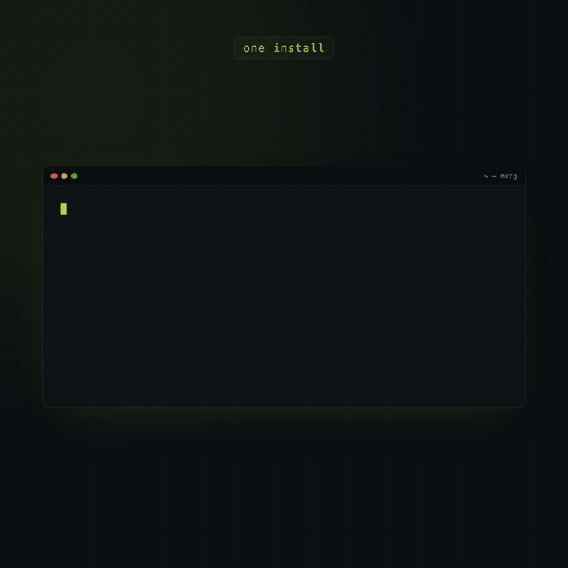

<p align="center">
  
</p>

<p align="center">
  <a href="https://github.com/MoizIbnYousaf/mktg/blob/main/LICENSE"></a>
  
  
  
  
</p>

<p align="center">
  <b>One install gives AI agents a complete CMO brain — brand memory, parallel research, and 41 composable marketing skills.</b>
</p>

---

## The Problem

You have a product. You need marketing. You ask your AI agent to help.

It writes generic copy. It doesn't know your voice. It forgets your audience by next session. It can't research competitors, plan keywords, or coordinate a launch. Every conversation starts from zero.

**mktg fixes this.** One install turns your agent into a marketing department that remembers everything, researches in parallel, and gets sharper with every session.

---

## How It Works

<p align="center">
  
</p>

---

<p align="center">
  
</p>

---

## Quick Start

```bash
bun install -g mktg && mktg init
```

That's it. `init` detects your project, scaffolds `brand/`, installs 41 skills to `~/.claude/skills/`, installs 5 marketing agents to `~/.claude/agents/`, and runs `doctor` to verify everything works.

Then use `/cmo` in Claude Code:

```
> /cmo help me market this app

Looking at your brand profile...

Your positioning is strong but you have zero distribution.
Here's what I'd do: write 3 SEO articles targeting your best
keywords, then atomize them into social posts. That gives you
a content engine.

Want to start there?
```

`/cmo` reads your project's marketing state, understands what's been done and what's missing, and routes to the right skill. It's not a menu — it's a strategic partner.

### Requirements

- [Bun](https://bun.sh) (runtime + package manager)
- [Claude Code](https://code.claude.com) (or any agent that reads `~/.claude/skills/`)

---

## How It's Different

Other marketing skill repos give you a folder of markdown files and wish you luck. **mktg is infrastructure.**

| | mktg | Other skill repos |
|---|---|---|
| **Install** | `bun install -g mktg && mktg init` | `git clone` + manually copy files |
| **CLI** | 9 top-level commands, JSON output, exit codes, `--dry-run` | None |
| **Memory** | 9 brand files that compound across sessions | Stateless — starts from scratch every time |
| **Health checks** | `mktg doctor` with pass/warn/fail diagnostics | None |
| **Skill lifecycle** | Dependency DAG, freshness tracking, versioning | Flat directory of markdown |
| **Integration checks** | Proactive env var verification before routing | Fails mid-execution |
| **Schema introspection** | `mktg schema --json` for agent self-discovery | None |
| **Tests** | Extensive Bun tests (real file I/O, no mocks) | 0 |
| **Orchestrator** | `/cmo` with routing table, disambiguation, guardrails | Command menus |

---

## Why a CLI?

Marketing skills are just markdown files. So why build a real CLI around them?

**Because skills alone can't answer "what's the state of my marketing?"**

Without infrastructure, your agent has no way to know which skills are installed, whether brand files exist, if API keys are configured, or what's been done vs. what's missing. It reads a skill, does one thing, and forgets. There's no continuity, no health checks, no lifecycle.

The CLI gives agents something skills can't:

- **`mktg init`** — One command bootstraps everything. Detects your project, scaffolds `brand/`, installs skills and agents, runs doctor. Works on any machine, every time.
- **`mktg status --json`** — A structured snapshot of your marketing state. `/cmo` reads this on every activation to know what exists, what's stale, and what to suggest next.
- **`mktg doctor --json`** — Health checks with pass/warn/fail. Are skills installed? Are brand files populated? Are API keys set? The agent knows before it tries — instead of failing mid-execution.
- **`mktg update`** — Skill versioning. When skills improve, one command updates them all without touching your brand memory.
- **`mktg schema --json`** — Self-discovery. The agent can introspect every command, flag, and output shape at runtime.

The pattern: **skills are knowledge, the CLI is infrastructure.** Skills teach your agent *how* to do marketing. The CLI tells it *where things are*, *what's ready*, and *what's broken*. Together they create a feedback loop that gets smarter every session.

---

## Brand Memory

This is mktg's secret weapon. The `brand/` directory holds nine files that compound across sessions:

```
brand/
├── voice-profile.md      # How you sound
├── positioning.md        # Why you're different
├── audience.md           # Who you're talking to
├── competitors.md        # Who you're up against
├── keyword-plan.md       # What people search for
├── creative-kit.md       # Visual identity rules
├── stack.md              # Marketing tools in use
├── assets.md             # Created assets log (append-only)
└── learnings.md          # What worked, what didn't (append-only)
```

**Session 1:** Research from scratch. **Session 10:** Your agent knows your voice, audience, competitors, keyword gaps, and what's worked before. No other marketing skill system does this.

Foundation research launches 3 agents **in parallel** — brand voice extraction, audience persona building, and competitor teardown — all writing back to `brand/` simultaneously.

---

## Skills (41)

Organized by marketing layer — foundation builds up to distribution.

<details>
<summary><b>Foundation (9 skills)</b> — Brand identity, audience research, competitive intelligence</summary>

| Skill | What it does |
|-------|-------------|
| **cmo** | Orchestrates all 41 skills. Routing table, disambiguation, guardrails. |
| **brand-voice** | Define or extract brand voice from existing content |
| **audience-research** | Build buyer personas with parallel web research |
| **competitive-intel** | Analyze competitors with real-time web intelligence |
| **positioning-angles** | Find the angle that makes your product sell |
| **brainstorm** | Structured exploration when direction is unclear |
| **document-review** | Audit brand files for completeness and consistency |
| **create-skill** | Extend the playbook with custom marketing skills |
| **marketing-psychology** | Apply behavioral psychology to any marketing asset |

</details>

<details>
<summary><b>Strategy (4 skills)</b> — Keywords, pricing, launch timing, plan strengthening</summary>

| Skill | What it does |
|-------|-------------|
| **keyword-research** | Six Circles framework for SEO keyword strategy |
| **launch-strategy** | Product Hunt, beta, and go-to-market playbooks |
| **pricing-strategy** | Van Westendorp, value-based, freemium analysis |
| **deepen-plan** | Strengthen any plan with parallel research agents |

</details>

<details>
<summary><b>Execution (17 skills)</b> — Copy, content, SEO, creative, conversion optimization</summary>

| Skill | What it does |
|-------|-------------|
| **direct-response-copy** | Landing pages, cold emails, headlines, copy editing |
| **seo-content** | SEO articles, programmatic SEO at scale |
| **lead-magnet** | Ebooks, checklists, templates, opt-in resources |
| **creative** | Visual asset briefs, ad copy variants |
| **marketing-demo** | Product demo recordings and walkthroughs |
| **paper-marketing** | Design carousels and social graphics in Paper |
| **slideshow-script** | Generate 5 narrative scripts for visual content |
| **video-content** | Assemble videos from slides (ffmpeg + Remotion) |
| **tiktok-slideshow** | End-to-end: script → design → video |
| **app-store-screenshots** | App Store screenshot pages (Next.js export) |
| **frontend-slides** | Animated HTML presentations and pitch decks |
| **seo-audit** | Technical SEO, site architecture, schema markup |
| **ai-seo** | Optimize for AI search (ChatGPT, Perplexity) |
| **competitor-alternatives** | "X vs Y" and "X alternatives" comparison pages |
| **page-cro** | Landing page conversion rate optimization |
| **conversion-flow-cro** | Signup, onboarding, paywall flow optimization |
| **resend-inbound** | Inbound email handling via Resend |

</details>

<details>
<summary><b>Distribution (9 skills)</b> — Email, social, newsletters, third-party integrations</summary>

| Skill | What it does |
|-------|-------------|
| **content-atomizer** | Repurpose long-form into multi-platform social posts |
| **email-sequences** | Welcome, nurture, launch, and drip campaigns |
| **newsletter** | Editorial newsletter design, writing, and growth |
| **churn-prevention** | Cancel flows, dunning emails, win-back campaigns |
| **referral-program** | Viral referral loops and incentive design |
| **free-tool-strategy** | Engineering-as-marketing free tool planning |
| **typefully** | Schedule and publish social posts via Typefully API |
| **send-email** | Transactional emails via Resend API |
| **agent-email-inbox** | AI agent email inbox with Resend |

</details>

---

## Agents (5)

Parallel sub-agents for research and review. Spawned by `/cmo` during foundation building:

| Agent | Role |
|-------|------|
| **brand-researcher** | Deep brand voice extraction using Exa web search |
| **audience-researcher** | Buyer persona and watering hole discovery |
| **competitive-scanner** | Competitor teardown and positioning gap analysis |
| **content-reviewer** | Quality review for any marketing output |
| **seo-analyst** | SEO audit for content and pages |

Foundation research launches all 3 research agents **in parallel** — brand, audience, and competitors simultaneously. Results write back to `brand/` so every future session benefits.

---

## Commands

| Command | Purpose |
|---------|---------|
| `mktg init` | Scaffold `brand/` + install skills + install agents |
| `mktg status` | Project marketing state snapshot |
| `mktg doctor` | Health checks: brand files, skills, agents, CLI tools, integrations |
| `mktg list` | Show all 41 skills with install status and metadata |
| `mktg update` | Re-install skills from latest package version |
| `mktg schema` | Introspect all commands, flags, and output shapes |
| `mktg skill` | Inspect, validate, register, and analyze skills |
| `mktg brand` | Export, import, diff, and review brand memory |
| `mktg run` | Load a skill for agent consumption and log execution |

Every command supports `--json` for agent consumption, `--dry-run` for safe previews, and `--fields` for selective output.

---

## Integration Checks

Third-party skills (Typefully, Resend) need API keys. mktg checks **proactively** — before routing, not mid-execution:

```bash
$ mktg doctor --json | jq '.checks[] | select(.name | startswith("integration"))'

{
  "name": "integration-TYPEFULLY_API_KEY",
  "status": "warn",
  "detail": "TYPEFULLY_API_KEY not set — needed by typefully"
}
```

`/cmo` reads this and guides setup before routing to a skill that needs the key. Missing integrations produce warnings, never blockers — progressive enhancement means every skill works at zero config.

---

## Architecture

```
src/
├── cli.ts              # Entry point, command router
├── types.ts            # All shared TypeScript types
├── commands/           # 9 top-level commands (init, doctor, list, status, update, schema, skill, brand, run)
└── core/               # Shared modules (output, errors, brand, skills, agents, integrations)

skills/                 # 41 SKILL.md files → installed to ~/.claude/skills/
├── cmo/                # Orchestrator with rules/, references/
├── brand-voice/
├── direct-response-copy/
└── ...

agents/                 # 5 agent .md files → installed to ~/.claude/agents/
├── research/           # brand-researcher, audience-researcher, competitive-scanner
└── review/             # content-reviewer, seo-analyst

skills-manifest.json    # Source of truth for skill metadata
agents-manifest.json    # Source of truth for agent metadata
```

### Design Principles

1. **Progressive Enhancement** — Every skill works at zero context. Brand memory enhances, never gates.
2. **Agent-Native** — JSON output, structured errors, exit codes 0–6, `--dry-run`, schema introspection.
3. **Self-Bootstrapping** — `mktg init` installs everything on any machine. No manual setup.
4. **Drop-In Skills** — Add a skill by dropping `SKILL.md` + updating `skills-manifest.json`.
5. **Skills Never Call Skills** — Skills read/write files. `/cmo` orchestrates. No implicit chains.
6. **Parallel by Default** — Foundation building spawns 3 research agents simultaneously.
7. **Warn, Never Gate** — Missing dependencies produce warnings, not blockers.

---

## Development

```bash
git clone https://github.com/MoizIbnYousaf/mktg.git
cd mktg

bun install           # Install dependencies
bun run dev doctor    # Run locally
bun test              # Extensive Bun test suite, real file I/O, no mocks
bun x tsc --noEmit    # Type check
bun run build         # Build
```

### Project Structure

- `src/` — CLI source (TypeScript, ~4,400 lines)
- `skills/` — 41 SKILL.md files (~44,000 lines of marketing expertise)
- `agents/` — 5 agent definitions
- `tests/` — Bun test suite for CLI and runtime behavior
- `website/` — Next.js marketing site
- `docs/` — Reference docs (`EXIT_CODES.md`, `skill-contract.md`)

---

## Contributing

Contributions welcome. The easiest ways to help:

1. **Add a skill** — Drop a `SKILL.md` in `skills/<name>/` and add an entry to `skills-manifest.json`
2. **Improve existing skills** — Better prompts, more examples, edge case handling
3. **Add tests** — Real file I/O in isolated temp dirs, no mocks
4. **Report issues** — [github.com/MoizIbnYousaf/mktg/issues](https://github.com/MoizIbnYousaf/mktg/issues)

---

## License

[MIT](LICENSE) — Use freely. Build on it.

---

## Acknowledgments

- [Corey Haines' Marketing Skills](https://github.com/coreyhaines31/marketingskills) — the breadth skill collection that inspired many of mktg's 41 skills
