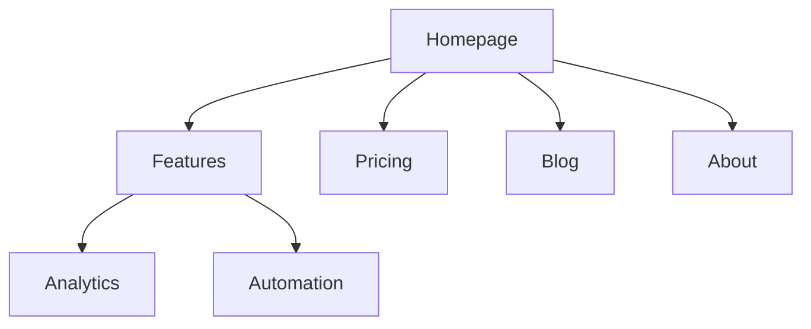
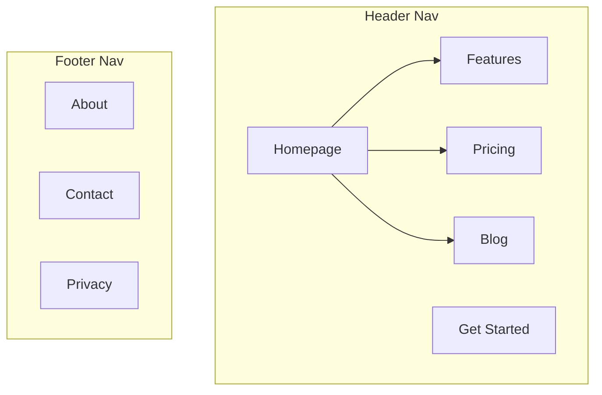

# Architecture Patterns

Site type templates, URL patterns, and navigation specs for common website types.

---

## SaaS Marketing Site

### Page Hierarchy

```
Homepage (/)
├── Features (/features)
│   ├── Feature A (/features/feature-a)
│   ├── Feature B (/features/feature-b)
│   └── Feature C (/features/feature-c)
├── Pricing (/pricing)
├── Customers (/customers)
│   ├── Case Study 1 (/customers/company-name)
│   └── Case Study 2 (/customers/company-name-2)
├── Resources (/resources)
│   ├── Blog (/blog)
│   │   └── [Posts] (/blog/post-slug)
│   ├── Templates (/resources/templates)
│   └── Guides (/resources/guides)
├── Integrations (/integrations)
│   └── [Integration] (/integrations/integration-name)
├── Docs (/docs)
│   ├── Getting Started (/docs/getting-started)
│   └── API Reference (/docs/api)
├── About (/about)
│   ├── Careers (/about/careers)
│   └── Contact (/contact)
├── Compare (/compare)
│   └── [Competitor] (/compare/competitor-name)
├── Privacy (/privacy)
└── Terms (/terms)
```

**Header (6 items + CTA)**: Features | Pricing | Customers | Resources | Integrations | Docs | [Get Started]

**Footer columns**: Product, Resources, Company, Legal

---

## Content / Blog Site

```
Homepage (/)
├── Blog (/blog)
│   ├── [Category] (/blog/category/topic-slug)
│   └── [Posts] (/blog/post-slug)
├── Newsletter (/newsletter)
├── Resources (/resources)
│   ├── Guides (/resources/guides)
│   └── Tools (/resources/tools)
├── About (/about)
├── Contact (/contact)
├── Privacy (/privacy)
└── Terms (/terms)
```

**Header (4 items + CTA)**: Blog | Resources | About | Contact | [Subscribe]

**Sidebar** (on blog): Categories, Popular Posts, Newsletter signup

---

## E-Commerce

```
Homepage (/)
├── Shop (/shop)
│   ├── Category A (/shop/category-a)
│   │   ├── Subcategory (/shop/category-a/subcategory)
│   │   │   └── [Product] (/shop/category-a/subcategory/product-slug)
│   │   └── [Product] (/shop/category-a/product-slug)
│   └── Category B (/shop/category-b)
├── Collections (/collections)
├── Sale (/sale)
├── Blog (/blog)
├── Help (/help)
│   ├── FAQ (/help/faq)
│   ├── Shipping (/help/shipping)
│   └── Returns (/help/returns)
├── Cart (/cart)
├── Account (/account)
├── Privacy (/privacy)
└── Terms (/terms)
```

**Header (5 items + cart/account)**: Shop (mega menu) | Collections | Sale | Blog | Help | [Cart] [Account]

---

## Documentation Site

```
Docs Home (/docs)
├── Getting Started (/docs/getting-started)
│   ├── Installation (/docs/getting-started/installation)
│   ├── Quick Start (/docs/getting-started/quick-start)
│   └── Configuration (/docs/getting-started/configuration)
├── Guides (/docs/guides)
├── API Reference (/docs/api)
├── Examples (/docs/examples)
├── Changelog (/docs/changelog)
└── FAQ (/docs/faq)
```

**Sidebar** (persistent, left): Getting Started, Guides, API Reference, Examples, Changelog

**On-page**: Previous/Next navigation at bottom of each doc page

---

## Hybrid SaaS + Content

```
Homepage (/)
├── Product (/product)
│   ├── Feature A (/product/feature-a)
│   └── Feature B (/product/feature-b)
├── Solutions (/solutions)
│   ├── By Use Case (/solutions/use-case-slug)
│   └── By Industry (/solutions/industry-slug)
├── Pricing (/pricing)
├── Blog (/blog)
├── Resources (/resources)
│   ├── Guides, Templates, Webinars, Case Studies
├── Docs (/docs)
├── Integrations (/integrations)
├── Compare (/compare)
├── About (/about)
├── Privacy (/privacy)
└── Terms (/terms)
```

**Header (7 items + CTA)**: Product | Solutions | Pricing | Resources | Blog | Docs | Integrations | [Start Free Trial]

Use mega menus for Product, Solutions, and Resources.

---

## Small Business / Local

```
Homepage (/)
├── Services (/services)
│   ├── Service A (/services/service-a)
│   └── Service B (/services/service-b)
├── About (/about)
├── Testimonials (/testimonials)
├── Blog (/blog)
├── Contact (/contact)
├── Privacy (/privacy)
└── Terms (/terms)
```

**Header (5 items + CTA)**: Services | About | Testimonials | Blog | [Contact Us]

Keep flat (1-2 levels max). Every page reachable from header.

---

## Navigation Rules

### Header
- 4-7 items max (decision paralysis above that)
- CTA button rightmost, visually distinct
- Logo links to homepage (left side)
- Order by priority: most visited first

### Footer
Group into columns: Product, Resources, Company, Legal

### Breadcrumbs
```
Home > Features > Analytics
Home > Blog > SEO Category > Post Title
```
Mirror the URL hierarchy. Every segment clickable except current page.

### Mobile
- Hamburger menu for all nav items
- CTA visible without opening menu (sticky header)
- Accordion pattern for nested items

---

## URL Patterns by Page Type

| Page Type | Pattern | Example |
|-----------|---------|---------|
| Homepage | `/` | `example.com` |
| Feature page | `/features/{name}` | `/features/analytics` |
| Blog post | `/blog/{slug}` | `/blog/seo-guide` |
| Blog category | `/blog/category/{slug}` | `/blog/category/seo` |
| Case study | `/customers/{slug}` | `/customers/acme-corp` |
| Documentation | `/docs/{section}/{page}` | `/docs/api/authentication` |
| Landing page | `/{slug}` or `/lp/{slug}` | `/free-trial` |
| Comparison | `/compare/{competitor}` | `/compare/competitor-name` |
| Integration | `/integrations/{name}` | `/integrations/slack` |

### Common Mistakes
- Dates in blog URLs (adds no value)
- Over-nesting beyond 3 levels
- Changing URLs without 301 redirects
- IDs instead of slugs in URLs
- Inconsistent parent patterns

---

## Internal Linking

### Hub-and-Spoke Model
```
Hub: /blog/seo-guide (comprehensive overview)
├── Spoke: /blog/keyword-research (links back to hub)
├── Spoke: /blog/on-page-seo (links back to hub)
├── Spoke: /blog/technical-seo (links back to hub)
└── Spoke: /blog/link-building (links back to hub)
```

### Rules
- No orphan pages (every page needs at least one inbound internal link)
- Descriptive anchor text ("analytics features" not "click here")
- 5-10 internal links per 1000 words
- Link to important pages more often
- Cross-section links: features to case studies, blog to product pages

---

## Mermaid Templates

### Basic Hierarchy


### With Navigation Zones


### Color Key
- Green (`#4CAF50`): Existing pages (no changes)
- Blue (`#2196F3`): New pages to create
- Red (`#f44336`): Pages to remove or redirect
- Yellow (`#FFC107`): Pages to restructure
