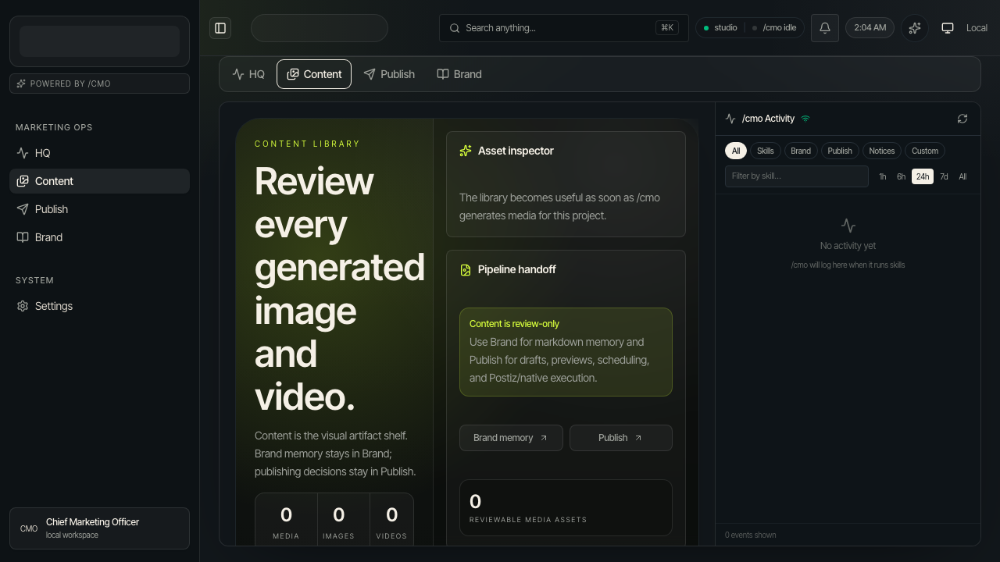
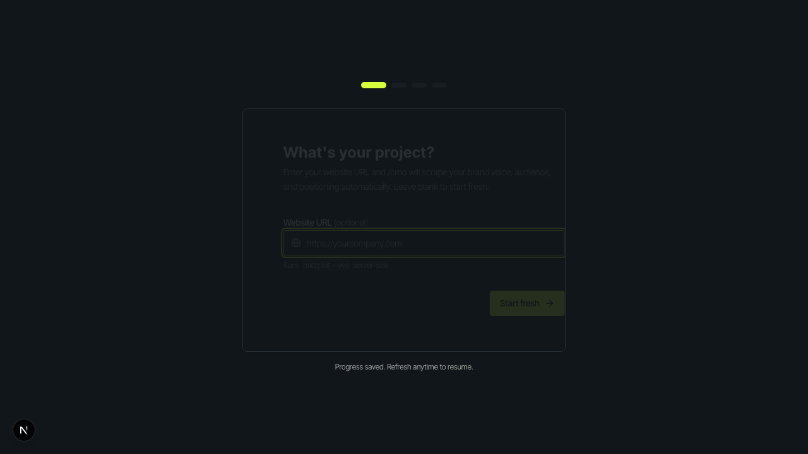
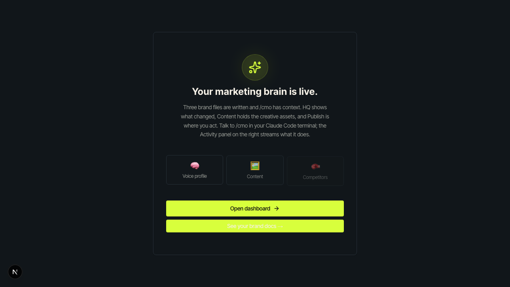
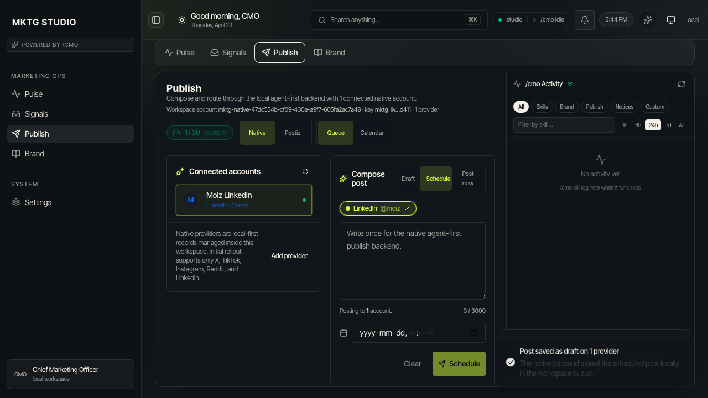
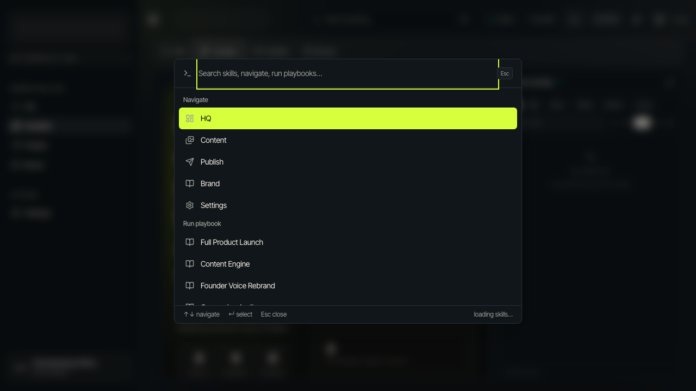
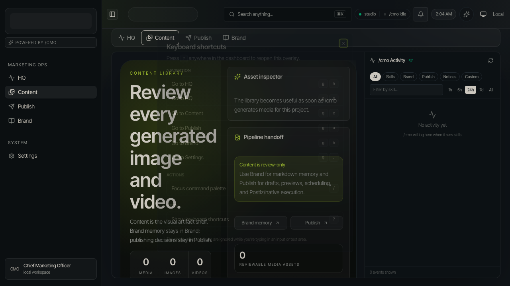
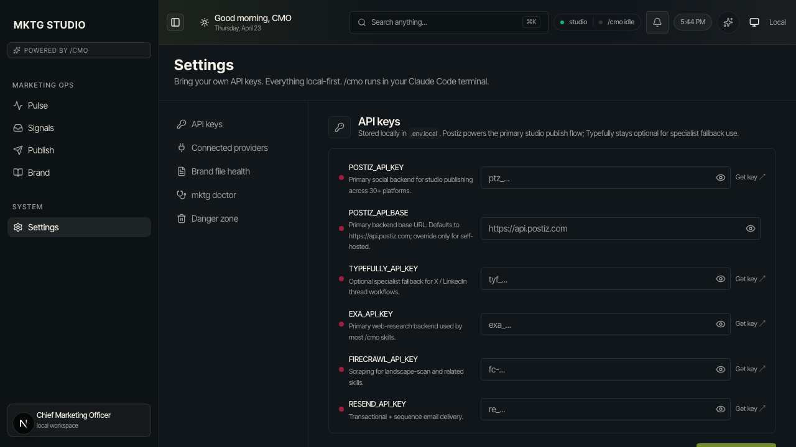

# mktg-studio

> The visual layer that ships inside [`marketing-cli`](https://www.npmjs.com/package/marketing-cli). Your brand memory on disk, one agent running the show.

Studio is the dashboard companion to the `mktg` CLI. The CLI ships the brain: 55 marketing skills + the `/cmo` orchestrator. Studio ships the eyes: a Next.js dashboard, a local Bun API, SQLite, live SSE, and a 21/21 agent-DX HTTP surface that `/cmo` drives via Bash + curl. No SDK, no MCP config. Claude Code already has `Bash`; that's the whole contract.

Studio lives under `studio/` inside the `marketing-cli` repo as a bun-workspace member. It is not a separate package. Installing the CLI brings the launcher with it.



## Quick start

```bash
npm i -g marketing-cli         # CLI + /cmo + 56 skills + studio launcher
mktg init                      # seed brand/*.md in the current project
mktg studio                    # boot API (:3001) + dashboard (:3000)
```

That is the canonical path for end users. `mktg studio` resolves the bundled launcher under `studio/bin/mktg-studio.ts`.

## Local development

Working on Studio itself? Clone the parent repo and use the workspace scripts:

```bash
git clone https://github.com/MoizIbnYousaf/marketing-cli.git
cd marketing-cli
bun install
bun --cwd studio run start:studio        # API + dashboard, tagged logs
```

`bun install` at the repo root wires both workspace members. See [`docs/DEVELOPER.md`](./docs/DEVELOPER.md) for the full dev guide and [`docs/SHIPPING.md`](./docs/SHIPPING.md) for launcher internals.

To point Studio at an external marketing project instead of the repo-local demo data:

```bash
MKTG_PROJECT_ROOT=/path/to/your/project bun --cwd studio run start:studio
```

`MKTG_PROJECT_ROOT` redirects both `brand/` and the SQLite file. Override either one separately with `MKTG_BRAND_DIR` or `MKTG_STUDIO_DB`.

On first boot the onboarding wizard asks for your API keys, then `/cmo` spins up three research agents (brand voice, audience, competitors) in parallel. Tabs light up as each finishes.

|  |  |
|---|---|
| Step 1: point at a URL and `/cmo` scrapes your voice, audience, and positioning. | Step 5: brand memory live, dashboard ready. |

## What you see

One tab per concern, an Activity panel streaming every `/cmo` write on the right. Cmd+K opens the palette, `?` shows every chord, the theme toggle flips dark / light / system.

| Tab | What it shows |
|-----|---------------|
| **Pulse** | What's happening right now: spikes, brief status, what to do next.  |
| **Signals** | Raw intel plus Trend radar over `brand/landscape.md` + `brand/competitors.md`. |
| **Publish** | Native local queue for X/TikTok/Instagram/Reddit/LinkedIn plus Postiz-backed external providers.  |
| **Brand** | Markdown editor for all 10 `brand/*.md` files with freshness + conflict detection. `assets.md` renders as a live visual asset board. |

The Activity panel never sleeps. Every skill run, every brand write, every toast streams through `/api/events` (SSE) and lands here live.

Keyboard-first: `Cmd+K` command palette, `?` help overlay, `g` + letter chords to jump surfaces (`g p` Pulse, `g s` Signals, `g t` Trend radar, `g u` Publish, `g b` Brand, `g ,` Settings).

|  |  |
|---|---|
| Cmd+K: search skills, navigate, run playbooks. | `?`: every chord, one page. |

Settings lives at `/settings`. Bring your own keys. Studio reads them from `.env.local` and writes back from the UI.



## What `/cmo` does for you

`/cmo` is the 2,400-line Claude Code skill that ships with `marketing-cli`. It routes user intent to the right marketing skill, runs the quality gate, writes brand files, and keeps Studio in sync via five HTTP verbs (`log`, `note`, `push`, `toast`, `navigate`) plus `GET /api/schema` and `GET /api/help` for self-discovery.

Full recipes in [`docs/cmo-integration.md`](./docs/cmo-integration.md). Five-minute end-to-end demo in [`docs/DEMO.md`](./docs/DEMO.md).

## Architecture

```
┌────────────────────┐     ┌───────────────────────┐
│ Next.js dashboard  │────▶│  Bun API server        │
│ :3000              │◀SSE│  :3001                 │
│                    │     │  SQLite + brand/*.md  │
└────────────────────┘     └──────────┬────────────┘
                                       │ HTTP (curl)
                           ┌───────────┴──────────────┐
                           │ /cmo (Claude Code)       │
                           │  drives the studio via   │
                           │  Bash + curl against     │
                           │  the 21/21 HTTP API      │
                           └──────────────────────────┘
```

- **Agent-first.** Every mutation goes through `/cmo`. Studio is the visible surface of the agent, not a replacement for it.
- **Files on disk.** Brand memory is `brand/*.md`, ops state is SQLite. No cloud dependency. Works offline except for `/cmo` (Claude Code) and postiz (REST).
- **Agent DX 21/21.** JSON-in / JSON-out, stable error envelope, `?fields=` projection, `?dryRun=true` safety rail, runtime schema at `/api/schema`. Compliance is validated by the live test suite at `tests/agent-dx.test.ts`.

## Develop

Full dev guide in [`docs/DEVELOPER.md`](./docs/DEVELOPER.md). The one-minute version, run from the `studio/` directory:

```bash
bun install                          # at repo root, wires the workspace
bun --cwd studio run start:studio    # both processes, tagged logs
bun --cwd studio test                # unit + server + integration + DX audit
bun --cwd studio run test:e2e        # Playwright walkthrough
```

CI runs typecheck + tests + Playwright on every push. User-facing support paths are documented in [`docs/SUPPORT-RUNBOOK.md`](./docs/SUPPORT-RUNBOOK.md) + [`docs/FAQ.md`](./docs/FAQ.md).

## Quality gate

| Check | Status |
|--------------|-------|
| Typecheck (`bun x tsc --noEmit`) | 0 errors |
| Unit + server + integration | 267 studio tests pass; marketing-cli 2,599 pass |
| Agent DX axes (7 × 3) | **21 / 21** |

## License

MIT, inherited from the parent `marketing-cli` repo. Postiz (AGPL-3.0) is kept at arm's length via the network boundary; we never import `@postiz/*`.
